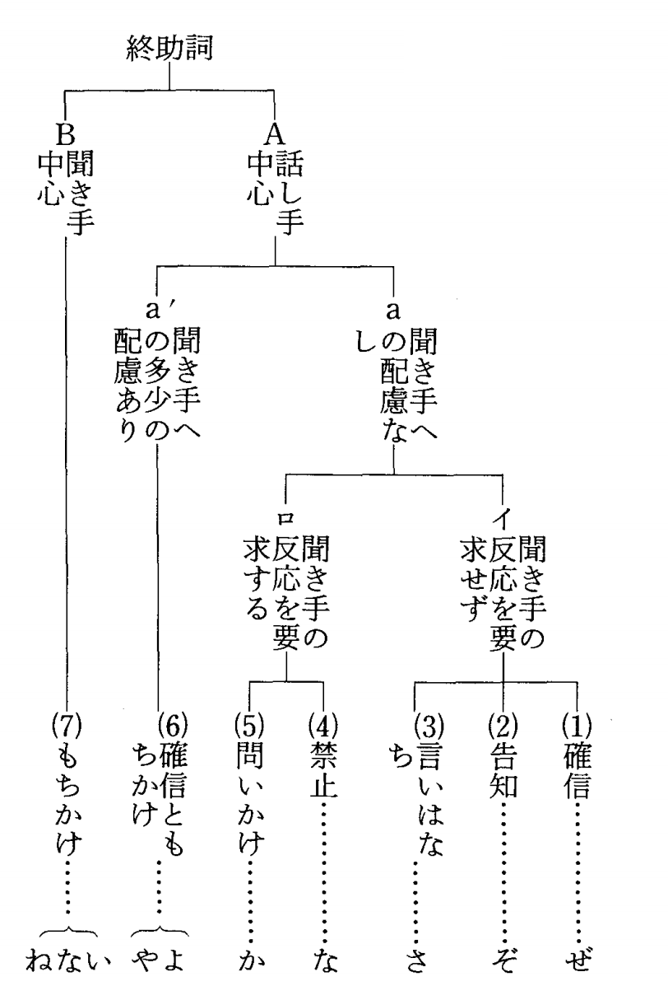

# 終助詞

> 文末で意味を表す働き。省略すると話者が主語になる。  
> 句の終わりにも登場する場合あり　→　これは間投助詞、間投詞とか言われたりする

## 一覧

- [か](#か)（疑問、反語、感動）
  - [が（方言）](#「が」)
  - かな
  - かも
- た
  - [だ（幼児語）](#「だ」)
- [す](#「す」)
- [と](#「と」)
- [め](#「め」) 
- な（感嘆、禁止、強調）
- の（強調的疑問、軽い断定）
- [ね](#ね)（同意や確認）
- よ（モダリティ、感動、強調）
- ぞ（強調）
- かな（確信のなさ）
- ぜ（勧誘、強調）
- わ（モダリティ、軽い断定）
- さ（軽い断定）
- や（感動、強調、呼びかけ）
- とも（強調）

```text
「か」のみが書き言葉  
それ以外は全て話し言葉
```

> 相関図  



> 接続表

|||ね|な(もちかけ)|よ|い|え|や|さ|ぞ|ぜ|
| ---            | ---    | ---           | --- | ---   | ---   | --- | --- | --- |--- |--- |
|終止形          |行く     |行くね         |行くな|行くよ  |- |- |- |行くさ |--- |--- |
|終止形          |おいしい |おいしいね       |おいしいな|おいしいよ  |- |- |- |おいしいさ |--- |--- |
|終止形          |きれいだ |きれいだね       |きれいだな|きれいだよ  |- |- |- |- |--- |--- |
|命令形          |行け     |- |- |行けよ        |- |- |行けや|--- |--- |--- |
|志向形          |行こう   |行こうね         |行こうな|行こうよ|- |- |行こうや|--- |--- |--- |
|助詞か          |行くか?  |行くかね？       |行くかな？|- |行くかい?|行くかえ?|- |--- |--- |--- |
|疑問詞＋だ      |何だ?   |何だね？         |- |- |何だい?  |何だえ?|- |--- |--- |--- |
|体言            |山      |山ね      |山な         |山よ（女性語）|- |- |- |--- |--- |--- |

> サンプル

- いま何時です`か`。（疑問）
- 遊んでばかりいてよいのだろう`か`。（反語）
- 今どこにいる`の`？（強調的疑問詞）
- 明日は晴れるといい`ね`。(同意や確認)
- いっしょに行こう`よ`。（勧誘）
- 約束だ`よ`。（念を押す）
- 雨`よ`、降れ。（呼びかけ）
- そんなことしたら、死ぬ`ぞ`！(強調)
- よそ見をする`な`。（禁止）
- いい人だ`な`。（感動）
- 明日は晴れるか`な`？(確信のなさ)
- 斉木、一緒トイレ行こう`ぜ`。(勧誘)
- 明日いく`わ`。(意思)
  - 女性を表す役割語としても使うが、「よ」同義。アニメやドラマなどの作られた役割語で、実際には使わない
  - 西日本の方言として使われる
- そりゃ、おいしいに決まってる`さ`。（軽い断定）
- あの`さ`、今日`さ`、暇？
  - 単純に注意をひきたいときに使う
  - 「ね」に置き換えても同義

## 聞き手中心

### <もちかけ>

#### 「い」

> 「い」は、「か（疑問）」「だ（疑問詞 + だ）」の後ろにつく  
> 親しみを込めて相手に問いかける役割

- 行くかい？
- 何だい？

#### 「ね」

`1)` 同意要求

- A:あの車、かっこいいですね（同意して欲しい）
- B:そうですね
- A:そろそろ帰るね（帰ることに同意して欲しい）
- B:うん、またね

`2)` 確認（質問）

- A:飯島はJUNONBOY出身でしたね？（合ってるかどうかの確認）
- B:うん、そうだね

`3)` 確認（回答）

- A:どんな女性が好みですか？
- B:やっぱり、かわいくて優しい女性ですね。（自分自身に自問自答しながら確認しながら）  
です。と断定するのではなく、「たしか、自分はこんな女性が好みだったはず・・」という曖昧さを匂わせる  

#### 「な」


## 話し手中心

### <確信ともちかけ>

#### 「よ」

> 終止形＋よ＝話し手の判断、確定、終了している内容を**相手に伝える**  
> **「相手に聞こえる様に言う独り言」** という感じ
 
- 寒いよ
- 静かだよ
- 行ったよ
- 雨が降るらしいよ

> 命令形＋よ、志向形＋よは、相手に行動を命令、勧誘することになる

- 行こう：独り言
- 行こうよ：一緒に行こうと誘っている
- 行け：独り言、願い事
- 行けよ：特定の個人（対象）に行く様に命令する
- 行って：独り言、願い事。命令形より柔らかい願い
- 行ってよ：特定の個人（対象）に行く様にお願いする

> 体言＋よ＝女性語　だけど、実際に使う人はほぼいない  
>> ドラマやアニメでのキャラ設定（役割後）や、小説などでわかりやすくするために使用される  
>> 「か」「だ」に変換できる

- 私だけよ
  - 私だけか
  - 私だけだ


#### 「や」

> 高知県などで使われる方言
> の、ん、もの　という意

- どうにもならんなっちょる`が`やき
  - = どうにもならなくなってる`ん`だから


## その他

### 「が」

> 

### 「だ」

> おもに幼児語）悪態をつくときに用いる。  

- いー`だ`。
- ふーん`だ`。
- あっかんべー`だ`。
- 知りませんよー`だ`。

### 「す」

> 口語で、「です」と同じ  
> 「です」よりも軽い（ぞんざい）イメージを与える  

- いいっ`す`
  - = いい`です`

### 「と」

> 引用や伝聞  
> 「って」と同じ意  

- 明日やるんだ`と`さ
  - 明日やるんだ`って`
- 何だ`と`？
  - 何だ`って`？

> 〜と思う、〜と思ったの意
> 独り言ではなく、相手に対して言うときは助言や提案になる

- （独り言）今日中に済ませよう`っと`
- （独り言）これでよし、`と`
- 明日は雨が降るので行かない方がいいか`と`
  - 「明日は雨が降るので行かない方がいいかと思うのですが、、」ぐらいの意味。少々固い表現
  - (조언, 제안) 말을 끝까지 안 함으로써 약간에 겸손함을 주는 뉘앙스
  - 「〜いいかと思うのですが、いかがでしょうか」아예 길게 하는 쪽이 제일 겸손함.

> 「しないといけない」の略

- 今日中にやっておかない`と`
  - 今日中にやっておかない`といけない`

> 九州の方言。「の」と同じ意

- 明日帰る`と`？
  - 明日帰る`の`？

### 「め」

> 相手を下げる。軽蔑を表す
> 相手に親しみを込める場合もある
> 녀석 같은 이미지

- こいつ`め`
- からす`め`


--------

## 終助詞を付けないパターン

> 主語を省略した話者の言葉
> くだけた言い方

- みそカツはあんまり好きじゃない。
  - 文脈上「誰が」を示す物はないが、話し手自身のことであろう。
- 雪が降ってる！
  - 実際に雪を見た本人の言葉
- おいしい！
  - 実際に食べた本人の言葉
- うれしい。
  - 自分の気持ちをただ聞いてほしいだけの時などは、何も付けなくていい。

> 選択肢の’うちの一つの場合

- 「欲しい？それとも、いらない？」「欲しい！」
  - どちらの答えにするか選ばせている。
- 帰れない。私ひとりじゃ。
  - 「帰れない」という言葉を選んだ。

> 単なる動作・状態を手短に言いたい時

- じゃあ、行ってくる。
  - と言って急いで出かける
- こら、どこ行く！？
  - あわてて質問
- あっ、先生が来た！
  - 突然の出来事
- あげる。
  - 余計な事は何も言わずに、さっと手渡す
